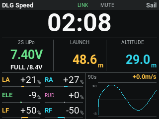
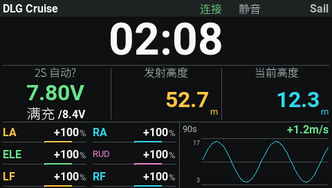
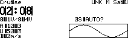
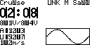
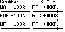

# DLGDash v1.0 · Sail

DLG / F3K 遥控器飞行仪表：大计时器、电压与满充参考、发射/当前高度、四/六舵机输出、平滑高度曲线，以及按模型配置的升降提示音。

[下载安装包](https://github.com/SailTechnology/DLGDash/releases/tag/v1.0) · [完整中文使用说明](scripts/edgetx/DLGDash/README.md) · [发布记录](docs/RELEASE-v1.0.md)

| 首批遥控器 | 分辨率 | 入口 | 状态 |
| --- | --- | --- | --- |
| PA01 | 320×240 | 彩屏 Widget | 主开发机型，发布版需复验 |
| HelloRadio V16 | 480×272 | 彩屏 Widget | 实验适配 |
| FrSky X9D 系列 | 212×64 | 黑白遥测脚本 | 实验适配 |
| RadioMaster GX12 | 128×64 | 黑白遥测脚本 | 实验适配 |

以 EdgeTX 2.11.3 为接口/字体测试基准。实验适配通过离线测试，**未经过这些机型的实机验收**，不承诺 OpenTX 或其他固件兼容。

## 界面

下图为执行真实 Lua 绘制代码生成的测试画面，使用 EdgeTX 原生字体；数据为模拟数据，不是飞行实测。

### PA01

### V16

### X9D / GX12

## 安装前必读

先备份 MODELS、RADIO 和已有插件配置。安装包只含插件，不含任何人的模型、诊断记录或固件。彩屏添加 DLGDash Widget；黑白屏在 Display 中选择 Script / DLG。逐个模型核对电压源、Zoom 模式、通道和按钮，详见完整说明。

所有飞行配置只读；仅添加显示页面需要用户在 EdgeTX 内保存页面配置。V16 / X9D / GX12 默认不绑定声音和清零按钮。主屏右上角署名 Sail，彩屏全屏时保留 SET 设置入口。

**在保持控制链路可靠、接收机兼容的前提下，ELRS 遥测回传频率应尽可能高。** 调整的是 Packet Rate 与 Telem Ratio 的配合，不是盲目追求最高控制包率；不要在飞行中改包率。插件不改变 ELRS 设置，平滑不能还原未回传的测量。参见 [ELRS 官方说明](https://www.expresslrs.org/quick-start/transmitters/lua-howto/#packet-rate-and-telemetry-ratio)。

## 开发

进入 `scripts/edgetx/DLGDash/tests`，执行 `pnpm install --frozen-lockfile` 和 `pnpm test`。首次测试下载并校验官方参考字体。运行 `Build-Package.ps1` 生成干净安装 ZIP；具体步骤和测试边界见使用说明。

中文位图使用 Noto Sans SC，许可证随包提供。第三方资源说明见 [THIRD_PARTY_NOTICES.md](THIRD_PARTY_NOTICES.md)。本项目未另行指定原创代码的开源许可证。
