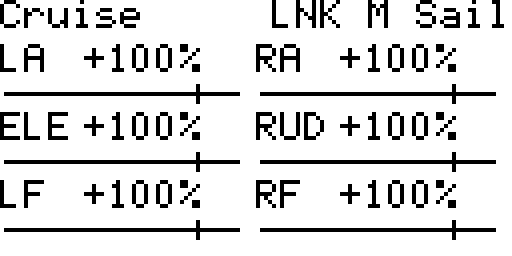
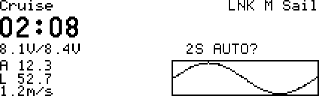

# DLGDash 从零安装教程

按顺序完成：**备份 → 复制文件 → 添加页面 → 设置本机参数 → 地面检查**。不需要改代码，也不需要先刷固件。

按[完整机型表](RADIOS.md)选择 **DLGDash-Color-v1.1.zip**（彩屏）或 **DLGDash-Monochrome-v1.1.zip**（黑白屏）。也可直接阅读 [彩屏教程](INSTALL-COLOR.md)或[黑白屏教程](INSTALL-MONO.md)。本版扩展常见机型，保留绘图和黑白屏内存、保存修复，仍需真机地面验证。下图使用模拟数据。

## 1. 先确定安装路线

| 遥控器 | 后面选择哪一步 |
| --- | --- |
| PA01、HelloRadio V16 | 第 5A 步：彩屏主屏 |
| HelloRadio V12 | [V12 独立安装教程](INSTALL-V12.md)，使用彩屏包 |
| FrSky X9D 系列、RadioMaster GX12、Zorro、Jumper T14 | 第 5B 步：黑白遥测屏 |
| TX16S（一代 / 二代）、TX15、PL18U、T15 / T16 / T18、X10 / X12S | 第 5A 步：彩屏主屏 |
| Boxer、Pocket、TX12、V14、T12 / T20 / T-Pro / T-Lite、X7 / X9 Lite / X-Lite / X9E | 第 5B 步：黑白遥测屏 |

打开遥控器 **SYS → VERSION / 版本**，记下 EdgeTX 版本。ELRS 3.3.1 等是射频版本，不是这里需要的系统版本。

本教程适用于 EdgeTX。看到 OpenTX 或 Ethos 时先核对兼容性，不要直接套用。GX12 的内置存储按同样方式操作；V16 和 V12 不是同一机型。

v1.1 增加 480×320 横屏和更多机型。不要用 beta.2 或其他旧包验证本次修复。其他未列出的黑白屏机型，请先提供 VERSION 页和报错照片，不必为了缺少 `table` 库直接刷固件。

所有实验机型仍需真机地面检查，包括打开设置、保存后重启读取、遥测和提示音。不要把离线测试通过当作已通过飞行验证。

## 2. 准备与连接

1. 飞机放稳，接收机先断电。不要在电机可能启动或正在飞行时安装。
2. 遥控器保证电量充足，准备一根能传数据的 USB 线。
3. 打开 [兼容测试版下载页](https://github.com/SailTechnology/DLGDash/releases/tag/v1.1)，展开 **Assets**。彩屏选 **DLGDash-Color-v1.1.zip**，黑白屏选 **DLGDash-Monochrome-v1.1.zip**。不要选 Source code，也不要仅下载 SHA256SUMS.txt。
4. 右键 ZIP，选择“全部解压缩”。打开后应看到 **SD** 文件夹，里面有 WIDGETS 和 SCRIPTS。
5. 遥控器正常开机，接 USB，选择 **USB Storage / USB 存储**。不要选择 Joystick / 游戏控制器。
6. 在 Windows“此电脑”里打开新出现的内容盘。正确盘通常包含 **MODELS、RADIO、SCRIPTS、SOUNDS**。
7. 若出现两个盘，不要向仅有 FIRMWARE.BIN、EEPROM.BIN 的固件盘复制文件。
8. Windows 要求格式化时，选择**取消**。安装插件不需要格式化。

**检查：** 你已经打开能看到 MODELS 和 RADIO 的盘。没有盘时，先检查数据线、数据接口和 USB 模式。

## 3. 备份全部模型

建议直接复制整个内容盘，这样最不容易遗漏。

1. 在电脑新建文件夹，例如“Zorro_安装前备份_日期”。不要把备份放在遥控器盘上。
2. 打开遥控器内容盘，复制全部内容到该文件夹。
3. 等待复制完成，再打开电脑里的备份。
4. 检查 **MODELS** 中的模型文件和 **RADIO** 文件夹确实存在；有 **BACKUP** 文件夹时也要保留，其中可能有旧模型备份。
5. 如果以前装过 DLGDash，确认 **WIDGETS/DLGDash** 和两个脚本入口也已备份。
6. 对比原盘与备份的文件数、大小，确认没有复制失败的提示。

空间不足时，至少备份完整 MODELS、RADIO、BACKUP（如有）、已有 WIDGETS/DLGDash，以及 SCRIPTS/TOOLS/DLGSetup 和 SCRIPTS/TELEMETRY/DLG 的文件。

**检查：** 拔掉遥控器后，电脑仍能打开备份。未完成备份前，不覆盖原文件。

## 4. 复制插件

1. 打开安装包内的 **SD** 文件夹。
2. 复制 **SD 里面的内容**，粘贴到遥控器内容盘根目录。
3. 允许合并同名文件夹。替换内容只应涉及 DLGDash 插件，不应要求覆盖 MODELS 或 RADIO。
4. 更新时保留自己原有的 `WIDGETS/DLGDash/profiles`，不要清空它。
5. 确认下列路径存在。以 H: 举例，你的实际盘符可能不同：

```text
H:/WIDGETS/DLGDash/             完整文件夹，含 lang 等内容
H:/WIDGETS/DLGDash/profiles/    空文件夹或自己的设置
H:/WIDGETS/DLGDash/diagnostics/ 空文件夹或自己的记录
H:/SCRIPTS/TOOLS/DLGSetup.lua
H:/SCRIPTS/TELEMETRY/DLG.lua
```

这几种位置是错的：

```text
H:/SD/WIDGETS/DLGDash/
H:/WIDGETS/DLGDash/DLGDash/
H:/SCRIPTS/TELEMETRY/DLG.lua.txt
```

黑白屏也需要完整 WIDGETS/DLGDash 文件夹，不能只复制 DLG.lua。旧固件保存设置还需要 profiles 文件夹；若解压工具漏掉了空文件夹，请在上述位置手动新建 profiles 和 diagnostics。

### 已安装过旧版

建议用新目录更新，避免残留旧文件：

1. 完整备份后，把原 `WIDGETS/DLGDash` 改名为未使用的名字，例如 `DLGDash-before-beta3`，不要覆盖已有备份。
2. 将 `SCRIPTS/TOOLS/DLGSetup.luac`、`SCRIPTS/TELEMETRY/DLG.luac` 改为未使用的 `.bak` 名字；不存在则跳过。不处理其他插件。
3. 从新 ZIP 复制 SD 里的内容，得到新的 `WIDGETS/DLGDash`。
4. 只把旧目录里的 `profiles` 复制回新目录，保留每个模型的设置。不要把旧 Lua、缓存或整个旧目录复制回来。
5. 安全弹出并重启。已添加的 DLGDash 页面无需重新添加。

Windows 可通过“查看 → 显示 → 文件扩展名”显示真实后缀。不确定文件身份时先保留并反馈文件列表。

### 复制结束后

1. 等待文件复制完成，关闭占用内容盘的窗口。
2. 在“此电脑”右键内容盘，选择“弹出”。
3. 安全弹出后拔线，退出 USB 模式并重启遥控器。

**检查：** 原有模型正常开机。此时还没有新仪表是正常的，继续添加页面。

## 5A. PA01 / V16 添加彩屏主屏

1. 确认当前选中的是要使用仪表的模型。
2. 进入 **Screen Settings / 屏幕设置**。常见入口为主屏菜单、TELE 键或触摸导航菜单。
3. 选择一个空白主屏页；替换已有页前先拍照记下原布局。
4. 将 **Layout / 布局**选为一个大区域的 **1×1**。
5. 进入 **Setup Widgets / 设置控件**，选中该大区域。
6. 在控件列表中选择 **DLGDash**。
7. 若弹出 ToneSw、SwHigh、ToneMin、Timer，可先保持默认，稍后统一在 DLG Setup 设置。
8. 返回主屏，应看到大计时器、电压区和高度区。接收机未供电时显示无数据是正常的。
9. 关闭该页面不需要的顶部栏、飞行模式栏、滑杆及微调显示，让 1×1 控件占满画面。**不需要开启 App Mode**；只隐藏显示，不禁用真正的微调或控制功能。
10. 日常设置可从系统 **TOOLS → DLG Setup** 打开。也可长按仪表选择 **Full screen / 全屏**，再点 **SET** 或按确认键。铺满画面后，直接点仪表不会打开设置；使用上述任一入口。


**检查：** 能看到仪表，并能打开 BATTERY 设置页。继续第 6 步。

## 5B. X9D / GX12 / Zorro / T14 添加黑白遥测屏

1. 确认当前模型，进入 **模型设置**。
2. 用 PAGE / 翻页键找到 **DISPLAY / 显示**，通常位于 TELEMETRY / 遥测之后。
3. 找到一个空闲的 Screen / 屏幕；已有内容时先记下或换另一个空闲位置。
4. 选中屏幕类型，按确认，把 Nums / Bars 改为 **Script**，再确认。
5. 在旁边的脚本名称栏选择 **DLG**，确认。
6. 退出所有设置，回到遥控器正常主屏。
7. 使用遥控器原生的遥测快捷键进入遥测屏。单 PAGE 键的 X9D 通常长按 PAGE；使用分开翻页键的机型通常从主屏按上一页键。若先进入别的遥测屏，再翻到 DLG。
8. 应看到大计时器、电压、高度和右下角曲线。
9. 在 DLG 内转滚轮或按加减键，切换“飞行总览”和“舵量”。
10. 按确认键进入设置，或在系统 TOOLS 中打开 **DLG Setup**。






找不到 DLG 时，检查 `SCRIPTS/TELEMETRY/DLG.lua` 的位置和后缀。不要到彩屏的 Widget 菜单寻找，也不要只从文件管理中执行 DLG.lua 来代替绑定页面。

**检查：** 能进入仪表、切换舵量页、打开设置。

### T14 地面检查

T14 是 [128×64 OLED 黑白屏](https://www.jumper-rc.com/transmitters/t14-2/)，走上面的 **Script → DLG** 路线，不用 1×1 控件或 App Mode。

1. 安全弹出内容盘、拔线并重启，先确认原有模型正常。
2. 按第 5B 步，为自己选定的测试模型添加 **Script → DLG**。不要覆盖其他遥测脚本。
3. 回主屏后用遥测快捷键打开 DLG。单 PAGE 键固件通常长按 PAGE；有独立 TELE 键时按 TELE。
4. 转滚轮切换总览和舵量，按滚轮进入设置。先试选电压源、取消，再试修改并保存。
5. 第 9 页选 Chinese，保存，重启后确认设置仍在。也要检查 English。
6. 分别选四舵机、六舵机，检查正负 100% 时字号不跳变，第三排舵量没有超出屏幕。
7. 进入设置停留 2 分钟，翻页、选源、保存、退出，确认没有报错或自行关闭。
8. 有高度回传的接收机连接后，再验证曲线、清零按钮、Zoom 结算和升降提示音。没有 Alt 时显示无高度是正常状态。

安装只复制插件，不会自动为模型添加页面，也不会替你设置按钮或舵机映射。只测菜单和显示时，不必给飞机上电。

下面是模拟数据预览，不是真机照片。实际 OLED 可能显示为深底亮字。


本次 T14 测试版已开放 EdgeTX 2.10 的独立提示音音量。跟随系统、静音以及 1～5 档都可在第 8 页选择；较老固件仍使用系统总音量。

黑白屏为节省内存，打开设置期间暂停插件的曲线采样、发射跟踪和提示音；遥控器的控制、原生计时器和原生遥测继续运行。退出设置后恢复采样，曲线不连接中间缺失的时段。请在地面设置，发射过程中不要进入菜单。

## 6. 先学会保存，再切换中文

彩屏：点字段选择数值；没有触摸时用滚轮移动、按确认。底部 `<`、`>` 翻页，Save 保存，Exit 退出。

黑白屏：滚轮或加减键逐个选择字段，继续移动会选中底部 `<`、`>`、Save、Exit。底部横线表示当前选中的动作，按确认执行。进入选项列表后，按确认采用、按返回取消。

修改后必须选择 **Save / 保存**。星号表示尚未保存；连续两次退出会放弃修改。

彩屏设置被全屏切换打断时，再进入 DLGDash 全屏可继续当前草稿。草稿不是已保存设置，重启或切换模型前仍需点保存。

V16 更新后请从主屏按滚轮进入设置，打开电压源列表、滚动、确认并保存；再停留至少 2 分钟。若仍自动返回，记录是否退出全屏、是否出现报错，并从 SYS → TOOLS → DLG Setup 再试一次。

切换中文：

1. 到 **LANGUAGE，第 9/10 页**。从第 1 页向前翻两次可到达。
2. 进入 Language，选择 **Chinese**，确认。
3. 选择 Save / 保存。
4. 退出并重新打开，确认仍为中文。


改回英文选 English。语言按模型保存，不改变系统菜单语言。黑白主飞行页保留简短字母；部分旧版彩屏固件会回退英文显示。

## 7. 设置电压、高度和计时器

1. 遥控器退出 USB 存储模式，接收机在地面供电。
2. 先在原生遥测页确认 **RxBt、Alt、VSpd** 是否正常。不要删除已经使用的传感器。
3. DLG Setup 的电池页：电压源选实际电池回传，例如 **RxBt**。不要选 RxBt+、RxBt- 或遥控器自身电压。
4. 核对插件实时读数与原生同名读数。**8.1V/8.4V** 表示当前 8.1V、满充参考 8.4V，不是两个测量值。
5. 电池节数可自动判断 1S/2S；已知电池规格时手动选择更明确。普通 LiPo 满充每节 4.20V，HV 每节 4.35V。未满电时不能仅凭电压可靠判断 HV。
6. 遥测与计时页：高度源选 **Alt**，垂直速度源选 **VSpd**；没有 VSpd 可选 None。
7. Timer 选择自己原本使用的 Timer 1/2/3。用原来的计时按钮检查是否同步。
8. 保存，缓慢抬高、放低飞机，核对原生高度与插件是否一起变化。

HV 选项不会提高硬件耐压。电池直供前须确认接收机和全部舵机允许该电压。

**检查：** 插件与原生同源读数一致，计时同步。两者一致却与万用表不同，应检查接收机测量和供电。

## 8. 设置发射高度和舵机通道

1. 在原生模型中确认爬升结束前使用的飞行模式，例如 Zoom。
2. 插件发射页的“退出此模式”选择这个模式，不要照抄别人的 FM 编号。
3. 初次用 **延迟 0 秒、延迟结束值**。先在地面切入该模式再退出，检查是否结算高度。
4. 需要退出后等一会再结算时，增加延迟。希望取模式内至延迟结束期间的最高值时，选“阶段峰值”。
5. 舵量页选择四舵机或六舵机。
6. 对照原生通道监视器，为 LA、RA、ELE、RUD 分别选择左右副翼、升降和方向所在通道；六舵机再设置 LF、RF 左右襟翼。
7. 缓慢移动控制，核对通道映射后保存。没有使用的通道可设 Off。

**旧版提示：** 出现 **MIX** 时，数值是混控量，未包含最终行程限制和输出反向，可能与实际舵机方向不同。不要为了匹配数字修改真正的舵机方向。数值也不是物理舵角。

## 9. 设置 Preset 清曲线

1. 到高度曲线页，选择“清曲线按钮”。
2. 选自己实际要用的开关或按钮；不确定名称时先在原生开关监视器核对。
3. 设置按下时的位置：Low 约 -100，Middle 约 0，High 约 +100。
4. 保存并退出设置。
5. 按按钮，应清空曲线；按住保持空图；松开约 0.5 秒后重新画图。
6. 一直空图时检查按钮是否一直有效；选 None 可取消绑定。

只清插件曲线，不会新增原生计时器或遥测清零动作。

## 10. 设置升降提示音

1. 到声音页，选择开关或按钮及有效位置。
2. 想开关保持时一直启用，选“保持有效时”；想按一下开、再按一下关，选“按下切换”。
3. 初次静区可用 0.3 m/s，小于静区不响。
4. 到“音量与音调”页，先选择跟随系统或较低音量，再按习惯调上升音调、下降音调和节奏。
5. 旧固件只提供跟随系统和静音，音量在遥控器系统设置中调整。
6. 保存并退出。设置页内会暂停提示音。
7. 在地面打开绑定，缓慢升降，核对上升较高短音、下降较低长音。
8. 接收机断电，插件应停音；原生失联告警应保持正常。

首次安装没有绑定按钮时，不响是正常的。

## 11. 设置曲线与回传速度

- 第一次使用建议窗口 90 秒、平滑 0.5 秒。
- 想看更长历史就增加窗口；平滑更大时线条更稳，反应也更慢。
- “采样/实际”显示实际绘图间隔，长窗口下可能比请求间隔长。
- **在控制链路可靠、接收机兼容的前提下，ELRS 有效遥测回传率应尽可能高。**
- 同一 Packet Rate 下，Telem Ratio 1:8 比 1:32 留出更多遥测时隙。不了解时先记下原设置，再参考 [ELRS 官方说明](https://www.expresslrs.org/quick-start/transmitters/lua-howto/#packet-rate-and-telemetry-ratio)。
- 不要在飞行中改包率。只提高控制包率不等于高度回传更快。

旧固件无法单独判断某个传感器是否停止更新；即使仍显示连接，也要核对原生高度与电压是否正常。不要用曲线平滑掩盖真正的遥测故障。

## 12. 飞行前逐项检查

- 所有模型仍在，混控、方向、行程与安装前相同。
- 重启后设置仍保存，切换其他模型后没有套用错误映射。
- 电压、高度、计时器与原生读数一致。
- Zoom 退出与延迟结算符合自己的习惯。
- 四/六路映射正确，99% 到 100% 不改变字号。
- Preset 按下清空、按住不闪、松开恢复。
- 提示音开关有效，接收机断电后停音。
- 同时使用原有脚本时没有内存或运行错误。

全部地面检查通过后，再由操作者决定试飞。仪表不能代替失控保护、原生告警或安全判断。

## 遇到问题

| 现象 | 先这样处理 |
| --- | --- |
| 电脑没有内容盘 | 换数据线，检查数据接口，选 USB Storage |
| 找不到 DLG Setup | 检查 SCRIPTS/TOOLS/DLGSetup.lua；重启后再看工具页 |
| 黑白屏找不到 DLG | 检查 SCRIPTS/TELEMETRY/DLG.lua，并在 Display 选择 Script |
| 提示缺文件或打开就报错 | 重新复制整个安装包，不要只更新一个 Lua；处理已备份的同名旧缓存 |
| not enough memory | 是运行内存不足，不是 SD 卡满；先用兼容测试包，仍出现时提供机型、版本和完整报错 |
| Lua APIs missing | 当前固件缺少所需功能，记录版本后反馈；不要删模型或刷 ELRS |
| SD write failed | 检查是否写保护、空间是否充足，以及 WIDGETS/DLGDash/profiles 是否存在 |
| 主屏没有数据 | 检查接收机供电、原生遥测、插件源选择 |
| 电压与万用表不符 | 先比较插件与原生同名 RxBt；不要盲目加偏移 |
| 曲线一直空 | 检查 Alt 和清曲线按钮是否一直有效 |
| 提示音不响 | 退出设置，检查绑定、有效位置、静音、静区和遥测 |
| 中文仍为英文 | 完整复制 lang；部分旧彩屏固件只能英文显示 |
| 黑白画面模糊或重叠 | 拍清晰近照，提供固件版本；先确认不是旧截图或缓存 |

反馈请提供机型、EdgeTX 版本、完整报错或短视频、复现步骤。不要公开上传整盘模型备份。

## 卸载与恢复

先备份当前设置。彩屏移除 DLGDash 控件；黑白屏把对应 Display 页面恢复为原来的内容，即可停止使用。

回退插件时，恢复安装前备份中的完整 DLGDash 文件夹和两个脚本入口。不需要刷固件，也不需要为了插件回退覆盖全部模型。
