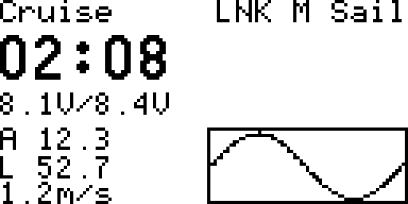
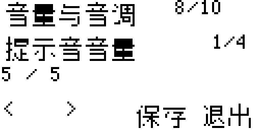

# 黑白屏安装与更新

适用 FrSky X9D 系列、RadioMaster GX12 / Zorro、Jumper T14，使用 EdgeTX。机型仍需地面验证；OpenTX、Ethos 和其他未知机型暂不保证兼容。

## 1. 下载与备份

1. 在 [beta.4 发布页](https://github.com/SailTechnology/DLGDash/releases/tag/v1.0.1-beta.4)展开 Assets，下载 **DLGDash-Monochrome-v1.0.1-beta.4.zip**。所有上述黑白屏机型使用同一个包，不下载 Color 包或 Source code。
2. 断开飞机电池，遥控器开机，拍下 SYS → VERSION 页，记录 EdgeTX 系统版本，不是 ELRS 版本。
3. 用数据线连接电脑，选择 USB Storage / USB 存储，不选 USB 摇杆。
4. 找到包含 MODELS、RADIO、SCRIPTS 的内容盘。内置存储同样操作；若提示格式化，取消，不向固件升级盘复制插件。
5. 在电脑新建带日期的备份文件夹，完整复制内容盘，检查 MODELS 和 RADIO 非空。已有插件还要确认 WIDGETS/DLGDash/profiles 已备份。

## 2. 旧版用户先处理缓存

第一次安装跳到第 3 节。

1. 完整备份后，把内容盘的 `WIDGETS/DLGDash` 改名为未使用的名字，如 `DLGDash-before-beta4`，不要覆盖已有备份。
2. 把 `SCRIPTS/TOOLS/DLGSetup.luac`、`SCRIPTS/TELEMETRY/DLG.luac` 改为未使用的 `.bak` 备份名字，没有就跳过。
3. 不修改其他插件，不删除 MODELS、RADIO 或模型遥测页。

Windows 打开“查看 → 显示 → 文件扩展名”。`.lua` 是源码，`.luac` 是编译缓存；新源码配旧缓存可能仍运行旧版。

## 3. 复制新文件

1. 解压 ZIP，打开里面的 **SD**，将 **SD 里面的内容**复制到内容盘根目录，允许合并及替换插件入口。
2. 旧版用户只将旧目录的 `profiles` 复制回新 `WIDGETS/DLGDash`，不要复制回旧源码、旧缓存或整个目录。
3. 检查以下文件和目录存在：

```text
WIDGETS/DLGDash/settings.lua
WIDGETS/DLGDash/mono-settings.lua
WIDGETS/DLGDash/pages/1.lua        pages 中应有 1.lua 至 10.lua
WIDGETS/DLGDash/lang/mono.lua
WIDGETS/DLGDash/lang/mono/
WIDGETS/DLGDash/profiles/
WIDGETS/DLGDash/diagnostics/
SCRIPTS/TOOLS/DLGSetup.lua
SCRIPTS/TELEMETRY/DLG.lua
```

不能多套一层 SD 文件夹，也不能只复制 DLG.lua。解压软件漏掉空文件夹时，手动新建 profiles 和 diagnostics。

4. 安全弹出内容盘，拔线并重启遥控器。模型、混控、行程、方向、射频设置不用更改。

若升级后要回收存储空间，确认电脑备份完整、新版设置正常后，再把内容盘里改名保留的旧插件目录移回电脑。不要删除当前 DLGDash 或其他模型文件。教程和 images 仅供阅读，可保留在电脑；运行所需的 `WIDGETS/DLGDash/lang` 不能删除。

## 4. 添加黑白遥测屏

1. 选择目标模型，进入模型设置，翻到 **DISPLAY / 显示**。
2. 选择一个空闲 Screen，类型设为 **Script**，脚本选 **DLG**。已有 DLG 页不需要重新添加。
3. 返回主屏，用遥测/翻页键进入 DLG 页面。
4. 在仪表内转滚轮或按方向键切换总览、舵量页；短按确认键进入设置。黑白屏不使用 1×1 或 App Mode。
5. 另一个设置入口是 **SYS → TOOLS → DLG Setup**。请两个入口都验证。




## 5. 设置与保存

滚轮或方向键移动高亮，确认键打开选项，调整后再确认。返回键取消当前列表。底部 `<`、`>` 翻页，Save 保存，Exit 退出。修改后必须看到 Saved / 已保存；有星号表示未保存，连续两次退出会丢弃修改。

| 页码 | 首次设置 |
| --- | --- |
| 1 电池 | 实际电压源通常选 RxBt，不选 RxBt+、RxBt- 或遥控器电压；设置 1S/2S 和普通/HV，已知电池类型时手动选更可靠 |
| 2 遥测 | 高度 Alt、垂直速度 VSpd、原生计时器、曲线平滑；无传感器的项选 None |
| 3 发射 | 指定退出的模式，通常 Zoom；设置退出延迟，以及延迟结束值或过程峰值 |
| 4、5 舵机 | 四/六舵机，按输出页映射 LA、RA、ELE、RUD、LF、RF，仅影响显示 |
| 6 曲线 | 时间窗、采样周期、清除按钮及生效位置 |
| 7 声音 | 自己指定按钮和位置，选择按住生效或按一下切换、升降死区 |
| 8 音量 | 音调、节奏、音量；旧固件只提供跟随系统或静音 |
| 9 语言 | English / Chinese，保存后重启检查 |
| 10 电压检查 | 对照选定源和 RxBt，插件不会自动修正接收机电压误差 |



## 6. 地面验收与排错

1. 遍历十页、修改和保存，再退出重进、重启，确认保存仍在；切换模型检查设置没有串用。
2. 对照原生遥测检查电压、高度、计时器；逐一操作舵面，检查显示对应。
3. 测试清曲线按钮，积累曲线后再次进入设置，确认无内存报错。
4. 测试声音开关和音量；设置菜单中插件暂停曲线采样、发射高度记录与升降音，退出恢复，不暂停原生控制和计时器。请在地面设置。
5. 在链路稳定和使用需求允许的前提下，尽可能提高 **ELRS 遥测回报率**，不是只提高控制包速率，不为曲线刷新牺牲链路稳定性。
6. 缺少 `table` 库不要求刷固件，beta.4 已有兼容处理；若仍报错，先检查包版本、pages 文件夹和旧缓存。
7. 再出现报错时不要飞行，拍下完整错误与 VERSION 页，说明从仪表还是 SYS 进入，以及哪一步触发；不要公开模型备份。

Zorro 也可参考包内 [Zorro 按键教程](INSTALL-ZORRO.md)。
