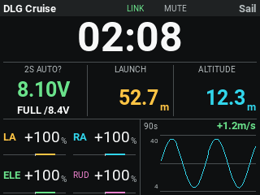
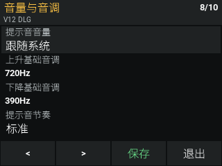
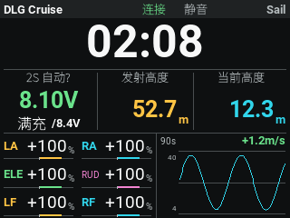

# HelloRadio V12 安装教程

适用于现款 HelloRadio V12、EdgeTX、320×240 横向彩屏。当前为实验适配，尚未通过 V12 实机验收。请在 [beta.5 发布页](https://github.com/SailTechnology/DLGDash/releases/tag/v1.0.1-beta.5)下载 `DLGDash-Color-v1.0.1-beta.5.zip`，不要误用 Zorro 黑白屏包。

本教程只安装 DLGDash 插件，不升级遥控器或 ELRS 固件。不同批次的系统菜单可能略有区别；若版本页不是 `edgetx-v12`，请先提供版本页照片，不要刷其他机型固件。

## 1. 先备份

1. 在地面操作，先断开飞机电池。
2. 打开遥控器，在系统的 VERSION / 版本页拍照，记录 EdgeTX 版本。ELRS 版本不是这里要看的系统版本。
3. 用支持数据传输的 USB 线连接电脑，选择 **USB Storage / USB 存储**，不要选摇杆模式。
4. 在电脑找到含有 `MODELS`、`RADIO`、`SCRIPTS` 的遥控器内容盘。若看到的是固件升级盘，不要向里面复制本插件。
5. 在电脑新建带日期的备份文件夹，把内容盘所有文件复制进去。已有 DLGDash 的用户也要备份 `WIDGETS/DLGDash/profiles`，这里保存各模型的插件设置。
6. 打开备份，检查 `MODELS` 和 `RADIO` 文件夹不是空的，再继续。

## 2. 复制安装包

1. 在电脑上解压测试 ZIP，打开里面的 `SD` 文件夹。
2. 把 **SD 里面的内容**复制到遥控器内容盘根目录，不是把整个 SD 文件夹放进去。
3. 已安装旧版时，只替换同名插件文件，不删除或覆盖 `MODELS`、`RADIO`，也不删除 `profiles`。
4. 旧版用户在备份后，删除 `WIDGETS/DLGDash` 内的 `.luac` 编译缓存，以及 `SCRIPTS/TOOLS/DLGSetup.luac`。只删这些插件缓存，不删其他脚本缓存，不删 `.lua` 源文件。
5. 检查路径应当是：

```text
遥控器内容盘/
  WIDGETS/DLGDash/main.lua
  WIDGETS/DLGDash/settings.lua
  WIDGETS/DLGDash/pages/1.lua
  WIDGETS/DLGDash/pages/10.lua
  WIDGETS/DLGDash/profiles/
  SCRIPTS/TOOLS/DLGSetup.lua
```

6. 安全弹出 USB 内容盘，拔线并重启遥控器。

## 3. 添加主屏仪表

V12 按官方配置没有触摸屏，以下用滚轮与确认、返回键操作。

1. 先切到准备使用 DLGDash 的模型。
2. 用按键打开主屏菜单，进入 **Screen Settings / 屏幕设置**。不同固件入口位置可能不同，找不到时先使用下一节的 SYS 设置入口。
3. 选择一个空白主屏页，布局选择 **1×1**。
4. 进入 **Setup Widgets / 设置控件**，选中大区域，按确认。
5. 选择 **DLGDash**。若看到 ToneSw、SwHigh、ToneMin、Timer，先保留默认。
6. 关闭该页面不需要的顶部栏、飞行模式栏、滑杆和微调显示，腾出显示空间。**不用 App Mode**，也不关闭实际的微调、混控功能。
7. 返回主屏，确认看到计时器、电压、发射高度、当前高度和右下角曲线。



## 4. 打开设置

推荐首次使用 **SYS / 系统 → TOOLS / 工具 → DLG Setup**：滚轮选中后按确认即可。

从仪表进入时，先通过控件菜单选择 **Full screen / 全屏**，进入全屏后再短按滚轮确认键打开插件设置。普通 1×1 主屏即使铺满画面，也不等于已经进入全屏，不能直接接收插件菜单按键。

- 滚轮：移动高亮或选择列表中的值。
- 确认键：打开选项、确认选择，或执行底部的 Save / 保存。
- 设置页底部 `<`、`>`：上一页、下一页；支持的固件也可用翻页键。
- 返回键：关闭选项列表；在设置页退出。修改未保存时，再按一次返回才丢弃修改。
- 修改后必须选中 **Save / 保存** 并确认，看到 **Saved / 已保存** 才表示成功。



## 5. 首次填写

1. 第 9 页 LANGUAGE：选择 English 或 Chinese，保存。
2. 第 1 页 BATTERY：飞机通电并有遥测后，选择实际电压源，通常是 `RxBt`，不要选 `RxBt+`、`RxBt-` 或遥控器自身电压。与系统遥测页同名读数对照。
3. 同页设置 1S / 2S 和普通 LiPo / HV。未满充的 HV 无法只凭电压可靠区分，已知电池类型时手动选择。显示的是当前电压与满充参考值，不是百分比。
4. 第 2 页 TELEMETRY：选择高度 `Alt`、垂直速度 `VSpd`、需要显示的原生计时器。没有相应传感器时不要随意选其他数值代替。
5. 第 3 页 LAUNCH：指定离开哪个飞行模式后结算发射高度，通常是 Zoom。按需要选择延迟和“延迟结束时高度”或“模式及延迟期间峰值”。
6. 第 4、5 页 SERVOS：选择四或六舵机，再对照模型输出页面逐一映射 LA、RA、ELE、RUD、LF、RF。映射只影响显示，不会调整飞机混控。
7. 第 6 页 GRAPH：选择曲线时间窗、采样周期和清除按钮及其有效位置。第 2 页可调曲线平滑程度。
8. 第 7、8 页 AUDIO：自己指定声音开关、有效位置、按住生效或按一下切换，再设置升降音调、死区、节奏和音量。V12 不会自动替你绑定某个开关。
9. 保存后退出，再进入，确认选择仍然保留。不同模型要分别配置。



## 6. 地面检查

1. 不飞行，检查滚轮能遍历十页菜单，电压、高度和开关列表能打开、确认、保存。
2. 分别测试 SYS 工具入口和仪表全屏入口，停留至少两分钟，再保存、退出。
3. 重启后确认设置仍在；切到另一个模型，确认没有误用上一模型的通道与开关。
4. 对照系统遥测页检查电压、高度。插件不会自行修正接收机上报不准的电压。
5. 操作各舵面，检查显示通道对应；测试清除曲线按钮和升降提示音开关。
6. 在链路稳定、符合实际使用需求的前提下，尽可能提高 **ELRS 遥测回报率**；不要只提高控制包速率，或为了曲线刷新牺牲链路稳定性。
7. 全部检查通过后才考虑飞行。出现报错时拍下完整错误及版本页；不要通过连续重试、忽略错误来开始飞行。

找不到 DLGDash 时优先检查是否多套了一层 SD 文件夹；找不到 DLG Setup 时检查 `SCRIPTS/TOOLS/DLGSetup.lua`。设置保存失败时检查 USB 已退出、存储盘可写、`profiles` 文件夹存在，并提供完整报错照片。

规格核对依据：[EdgeTX 现款 V12 配置](https://github.com/EdgeTX/edgetx/blob/92c3224699b545a47acaf8bd301b0ab4f2b91848/radio/src/targets/v12/CMakeLists.txt)。厂商定制固件的实际行为仍以实机为准。
