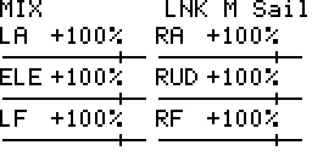
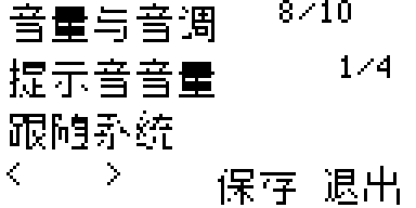

# Zorro 安装与更新

适用 **RadioMaster Zorro、128×64 黑白屏、EdgeTX**。本次为 **v1.0.1-beta.4**，包含进入设置时报 `attempt to index field '_G' (a nil value)` 的修复及旧固件兼容更新。此版本仍需真机地面验证，不要求先升级 EdgeTX 或 ELRS。

## 1. 下载黑白屏安装包

打开 [v1.0.1-beta.4 下载页](https://github.com/SailTechnology/DLGDash/releases/tag/v1.0.1-beta.4)，展开 **Assets**，只下载：

**DLGDash-Monochrome-v1.0.1-beta.4.zip**

不要下载 Source code。Zorro 与 X9D、GX12、T14 共用黑白屏包，旧版 Zorro 专用包用户也直接升级到此包；不要安装 Color 彩屏包。

## 2. 连接并备份

1. 飞机放稳，接收机先断电，遥控器保留足够电量。
2. Zorro 正常开机后接 USB 数据线，选择 **USB Storage / USB 存储**。
3. 在电脑打开含 **MODELS、RADIO、SCRIPTS** 的内容盘。若弹出格式化提示，点取消。不要向固件盘复制文件。
4. 在电脑新建“Zorro_更新前备份_日期”，把内容盘全部复制进去，等待完成。
5. 确认备份里有 MODELS、RADIO，以及原来的 WIDGETS/DLGDash。安装不需要改混控、行程、舵机方向或射频设置。

## 3. 已安装旧版：先处理旧文件

第一次安装可跳过本节。已有 DLG 遥测页不用删除或重新绑定。

1. 确认电脑备份完整后，在遥控器内容盘把 `WIDGETS/DLGDash` 改名为 `DLGDash-before-beta4`。如果此名字已存在，换一个没有被使用的备份名字，不要覆盖。
2. 打开 `SCRIPTS/TOOLS`。如果有 `DLGSetup.luac`，把它改名为 `DLGSetup.luac.bak`。
3. 打开 `SCRIPTS/TELEMETRY`。如果有 `DLG.luac`，把它改名为 `DLG.luac.bak`。
4. 已有同名 `.bak` 时换一个备份名字；不要覆盖之前的备份。不需要处理其他插件的文件。

Windows 先打开“查看 → 显示 → 文件扩展名”，避免把文件改成 `.lua.txt`。`.luac` 是旧编译缓存，保留它可能仍运行旧版本；原文件已备份，不需要删除全部 SCRIPTS。

## 4. 复制新版本并保留自己的设置

1. 右键下载的 ZIP，选择“全部解压缩”。
2. 打开解压后的 **SD**，把 **SD 里面的内容**复制到遥控器内容盘根目录，允许合并文件夹及替换 DLG 的两个 `.lua` 入口。
3. 更新用户：把刚改名的 `DLGDash-before-beta4/profiles` 文件夹复制进新的 `WIDGETS/DLGDash`，合并以保留各模型的插件设置。只复制 profiles，不把旧 `.lua`、`.luac` 或整个旧目录复制回来。
4. 确认下面的位置都存在。以 H: 为例，实际盘符可能不同：

```text
H:/WIDGETS/DLGDash/settings.lua
H:/WIDGETS/DLGDash/mono-settings.lua
H:/WIDGETS/DLGDash/lang/mono.lua
H:/WIDGETS/DLGDash/lang/mono/       中文图片文件
H:/WIDGETS/DLGDash/profiles/        自己的设置或空文件夹
H:/WIDGETS/DLGDash/diagnostics/     记录或空文件夹
H:/SCRIPTS/TOOLS/DLGSetup.lua
H:/SCRIPTS/TELEMETRY/DLG.lua
```

不要复制成 `H:/SD/WIDGETS/...`。黑白屏也必须有完整的 WIDGETS/DLGDash，不能只复制 DLG.lua。解压工具漏掉空目录时，手动新建 profiles 和 diagnostics。

复制完成后，安全弹出内容盘、拔 USB、重启遥控器。MODELS 和 RADIO 不需要覆盖。

## 5. 打开仪表和设置

已安装用户直接打开原 DLG 遥测页。第一次安装：

1. 选中要使用的飞机模型，进入模型设置，翻到 **DISPLAY / 显示**。
2. 选择一个空闲 Screen，将类型改为 **Script**，脚本选 **DLG**。
3. 回到正常主屏，按遥测翻页键进入遥测屏，再翻到 DLG。
4. 在 DLG 内转滚轮切换飞行总览和舵量页；按滚轮进入设置。
5. 也可从 **SYS → TOOLS → DLG Setup** 打开设置。本次请把两个入口都试一次。

以下为模拟数据，不是你的飞机实际回传：




## 6. 调整设置并保存

滚轮选字段，按滚轮进入选项，再转动选择、按下确认。返回键取消当前选项。继续转动可选到底部 `<`、`>`、Save、Exit，按滚轮执行。修改后一定选择 **Save / 保存**；星号表示未保存，连续两次退出会放弃修改。

| 页码 | 首次需要设置什么 |
| --- | --- |
| 1 电池 | 电压源选原生遥测里实际使用的 RxBt，不选 RxBt+、RxBt- 或遥控器电压；核对 1S/2S 和普通/HV |
| 2 遥测与计时 | 高度 Alt、垂直速度 VSpd、自己的 Timer 1/2/3；没有 VSpd 可选 None |
| 3 发射高度 | 选择自己实际的 Zoom 结束模式及延迟；先用 0 秒、延迟结束值，在地面切换检查 |
| 4、5 舵量 | 四/六舵机及每个通道映射；六舵机增加 LF、RF 左右襟翼 |
| 6 曲线 | 时间窗口、采样、平滑，以及 Preset 清曲线按钮和有效位置 |
| 7 声音 | 开关/按钮、有效位置、保持或按下切换、静区 |
| 8 音量与音调 | 上升/下降音调和节奏；旧固件音量选跟随系统或静音 |
| 9 语言 | 选 Chinese 切换中文，选 English 切回英文；保存后重启检查 |
| 10 电压检查 | 插件与原生读数不一致时对照电压源和 RxBt |



`8.1V/8.4V` 的左边是当前电压，右边是满充参考，不是两个实测值。HV 每节满充参考 4.35V；插件选 HV 不代表接收机和舵机能承受 HV 满充直供。

出现 **MIX** 时，舵量是混控量，不包含最终行程限制与输出反向，可能与舵机实际方向不同。不要为了匹配显示数字改动真正的舵机方向。

## 7. 本次重点测试

先在地面完成以下检查，不要直接带着测试版起飞：

- 从仪表按滚轮进入设置，以及从 TOOLS 打开 DLG Setup，都不再报错。
- 中文/英文切换正常；逐页打开选项，选择 Save，退出和重启后设置仍在。
- 原有模型、混控、方向、行程及其他插件不变。
- 接收机供电后，电压、高度、计时器与原生同源读数一致；摇杆动作与通道映射相符。
- Preset 按下清曲线，按住不闪，松开恢复；Zoom 退出后按自己的延迟结算。
- 提示音开关可控；接收机断电后显示失联并停音。保留原生低压告警和失控保护。

旧固件不能单独判断某个传感器是否停止更新，仍需核对原生遥测。在控制链路可靠、接收机兼容的前提下，尽可能提高 ELRS 的有效遥测回传率；不要在飞行中改包率。

## 仍然报错怎么办

| 现象 | 检查方法 |
| --- | --- |
| 仍报 `_G` 或 `table` 为 nil | 先确认下载的是 beta.4，并按第 3、4 节使用新目录及处理两个入口的旧缓存 |
| 提示缺文件 | 重新完整解压专用包，核对第 4 节路径；不要只更新单个 Lua |
| not enough memory | 这是运行内存不足；记录是在打开工具、进设置、翻页还是保存时发生，并提供完整报错 |
| 无法保存 | 检查 profiles 是否存在、是否写保护、内容盘空间是否充足 |
| 没有遥测 | 先检查接收机是否供电、原生 RxBt/Alt 是否有效；无回传不代表插件安装失败 |

反馈时提供 **Zorro 的 SYS → VERSION 完整照片、安装包文件名、报错照片或短视频、触发步骤**。不要公开整盘模型备份。问题可提交到 [Issues](https://github.com/SailTechnology/DLGDash/issues)。

## 回退

先备份当前内容。将当前插件文件夹另行保留，再把安装前的 DLGDash 文件夹及两个入口恢复到原路径。若只是停用，将对应 Display 页面换回原来的内容即可；不需要刷固件或恢复全部模型。
